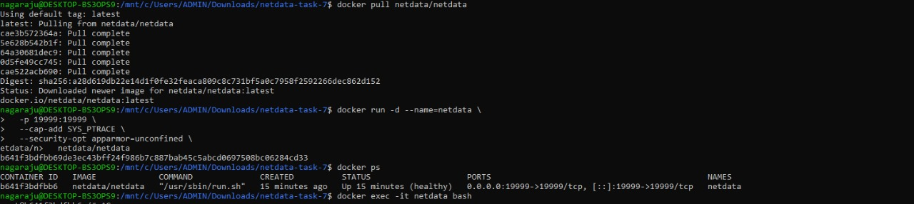
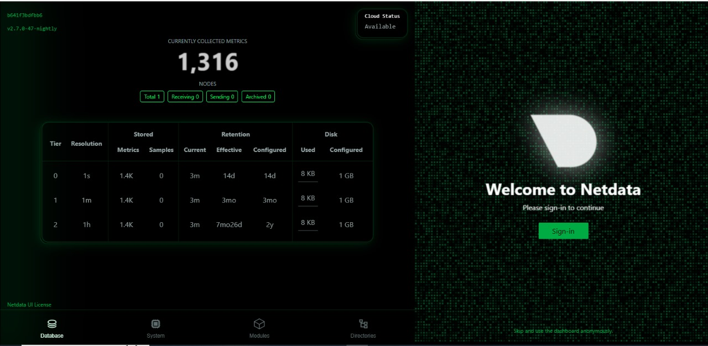
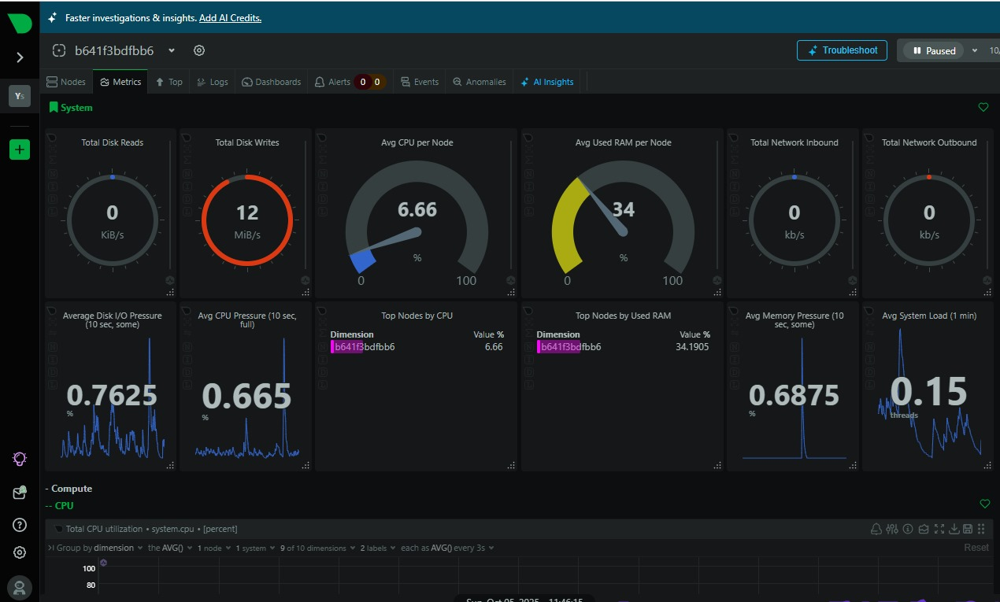
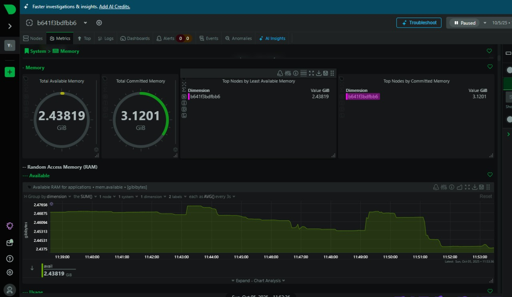

# Task 7: Monitor System Resources Using Netdata

## Objective
Install Netdata and visualize system and application performance metrics.

## Tools
- Netdata (Free, open-source monitoring tool)
- Docker

## Steps

### 1. Run Netdata with Docker
```bash
docker run -d --name=netdata -p 19999:19999 --cap-add SYS_PTRACE --security-opt apparmor=unconfined netdata/netdata
```

### 2. Access Dashboard
Open your browser at:  
👉 http://localhost:19999

### 3. Monitor Metrics
- CPU usage (per core and overall)
- Memory usage
- Disk activity
- Network throughput
- Docker containers

### 4. Explore Alerts
- Check alert panel for warnings and critical issues.

### 5. Explore Logs
Logs are stored at:
```bash
/var/log/netdata
```

Inside the container:
```bash
docker exec -it netdata bash
cd /var/log/netdata
ls -l
```

## Deliverables

### 1. Dashboard (CPU, Memory, Disk)


### 2. Docker Container Metrics


### 3. Alerts Panel


### 4. Extra Screenshot


## Outcome
Understand lightweight server and app monitoring using Netdata.
